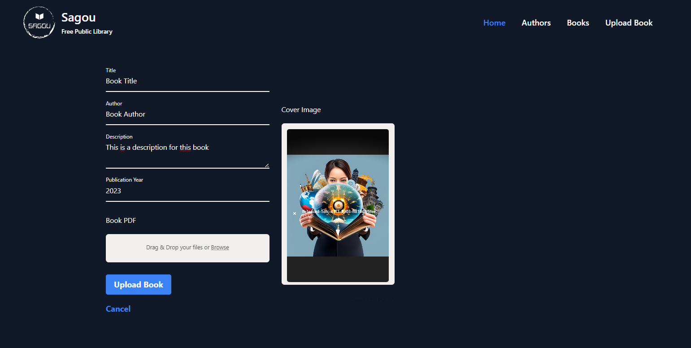

# Enligne Library Backend - Express.js

This is the backend server for the Enligne Library project. It provides an API for uploading, downloading, managing books, and author information. The server is built using Express.js, a fast and minimalist web application framework for Node.js.

**Note: This project primarily focuses on the backend implementation, and the frontend is not important for the current scope of this project. Therefore, no frontend-related details, such as UI design or frontend setup, are provided in this README file.**

## Getting Started

Follow these instructions to get a local copy of the project up and running on your machine for development and testing purposes.

### Prerequisites

Make sure you have the following software installed on your machine:

- Node.js (version X.X.X)
- npm (version X.X.X)

### Installing Dependencies

1. Clone the repository:

```shell
git clone https://github.com/medsagou/express-app.git
```

1. Install the dependencies:

```shell
npm install
```

Configuration

1. Create a `.env` file in the root directory based on the provided `.env`.example file.

2. Update the environment variables in the `.env` file to match your local environment.

### Screenshot



### Built with

- Semantic HTML5 markup
- CSS custom properties
- Flexbox
- CSS Grid
- Mobile-first workflow
- [Tailwindcss](https://tailwindcss.com/) - Css framework
- [Express.js](https://expressjs.com/) - back end web application framework
- [Modern css reset](https://piccalil.li/blog/a-modern-css-reset/) - piccalil

### Useful resources

- [W3schools](https://www.w3schools.com/) - This helped me for javaScript eventListener. I really liked this pattern and will use it going forward.
- [stackoverflow](https://stackoverflow.com/) - this website help me on the javascript when i get stock.

- [Tailwind UI](https://tailwindui.com/) - A helpful resource for finding useful class names for different components.

## Author

- Website - [Mohamed Sagou](https://github.com/medsagou)
- Frontend Mentor - [@medsagou](https://www.frontendmentor.io/profile/medsagou)
- Twitter - [@sagoumohamed](https://www.twitter.com/sagoumohamed)

```markdown
## Contributing

Contributions are welcome! If you find any issues or have suggestions for improvements, please open an issue or submit a pull request.
```
